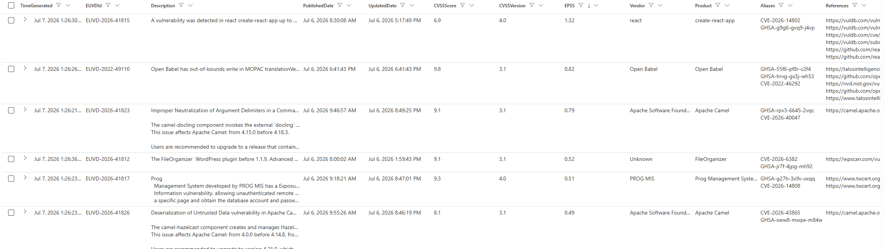

# EUVD to Log Analytics Table

A fully Azure-native, serverless pipeline that pulls vulnerability data daily from the
public [European Union Vulnerability Database (EUVD)](https://euvd.enisa.europa.eu/) API
into an Azure Log Analytics workspace and Microsoft Sentinel for threat intelligence,
hunting, analytics rules, workbooks, and incident management.

The whole solution deploys with a single Bicep template and uses **no secrets,
certificates, or shared keys anywhere**. All Azure-to-Azure authentication is done with
a user-assigned managed identity; the EUVD API itself requires no authentication.

Deployed in a max 15 minutes with the appropriate permissions ;-)



## Architecture

See [architecture.md](architecture.md) for the full data-flow diagram and component
descriptions. In short:

```
EUVD API --(HTTP GET, daily)--> Logic App --(Logs Ingestion API, managed identity)-->
  Data Collection Rule --> Log Analytics Workspace (EUVD_CL table) --> Microsoft Sentinel
```

## Quick start

```bash
az login

az group create \
  --name rg-euvd-prod \
  --location switzerlandnorth

# Review alertEmail in main.bicep if a different notification mailbox is needed.

az deployment group create \
  --subscription p-sub-001 \
  --resource-group rg-euvd-prod \
  --template-file main.bicep \
  --parameters parameters/prod.bicepparam
```

That's the entire installation. No secrets, connection strings, or manual portal steps
are required. See [deployment-guide.md](deployment-guide.md) for the full walkthrough
and post-deployment verification checklist.

## Repository structure

```
main.bicep                    Entry point, wires all modules together
modules/
  identity.bicep               User-assigned managed identity
  workspace.bicep               Log Analytics workspace
  tables.bicep                   Custom table + Data Collection Endpoint/Rule
  appinsights.bicep             Workspace-based Application Insights
  sentinel.bicep                 Sentinel onboarding + analytics rules
  logicapp.bicep                 Daily ingestion Logic App
  monitor.bicep                   Action Group
  alerts.bicep                     Failure alert
  roles.bicep                       Role assignments
parameters/
  prod.bicepparam                Production parameters
docs.md                        Consolidated technical reference
architecture.md                 Architecture and data flow
deployment-guide.md             Step-by-step deployment
operations-guide.md             Day-2 operations and KQL samples
troubleshooting-guide.md        Common issues and fixes
```

## Security model

- No client secrets, certificates, shared keys, connection strings, or local
  authentication anywhere in this project.
- The Logic App authenticates to Azure Monitor's Logs Ingestion API using its
  user-assigned managed identity (Microsoft Entra ID token, audience
  `https://monitor.azure.com`).
- The Log Analytics workspace has `disableLocalAuth` enabled, so workspace-key based
  ingestion is rejected even if attempted.
- Role assignments follow least privilege — see [docs.md](docs.md) for the exact roles
  and why each one is required.

## Disaster recovery

The entire environment is reproducible by re-running the deployment command above
against a fresh (or existing) resource group. No manual configuration is required.

## KQL Snippets
```
DeviceTvmSoftwareVulnerabilities
| join EUVD_CL on CveId

// Finds all vulnerabilities with an EPSS score greater than 20%.
// EPSS = the probability of a vulnerability being actively exploited within 30 days
DeviceTvmSoftwareVulnerabilities
| join EUVD_CL on CveId
| where EPSS > 20

```

## Notes


By default, the Logic App retrieves only the latest values from the EUVD for the past day.
For an initial backfill, temporarily change `Initialize_FromDate` in `modules/logicapp.bicep`
to `"@{formatDateTime(addDays(utcNow(), -365), 'yyyy-MM-dd')}"` and run the workflow once.
The workflow sends ingestion payloads in batches to handle larger backfills more reliably.

The First Ingestion of 365D of Data was about 0.012 GB, so you don't have to be afraid of the Costs.
